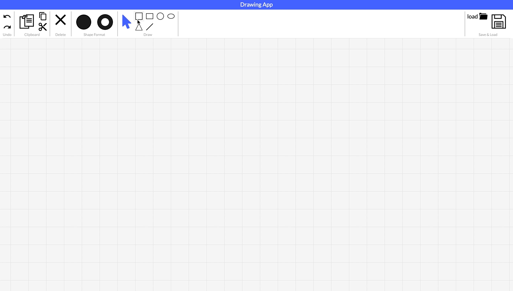
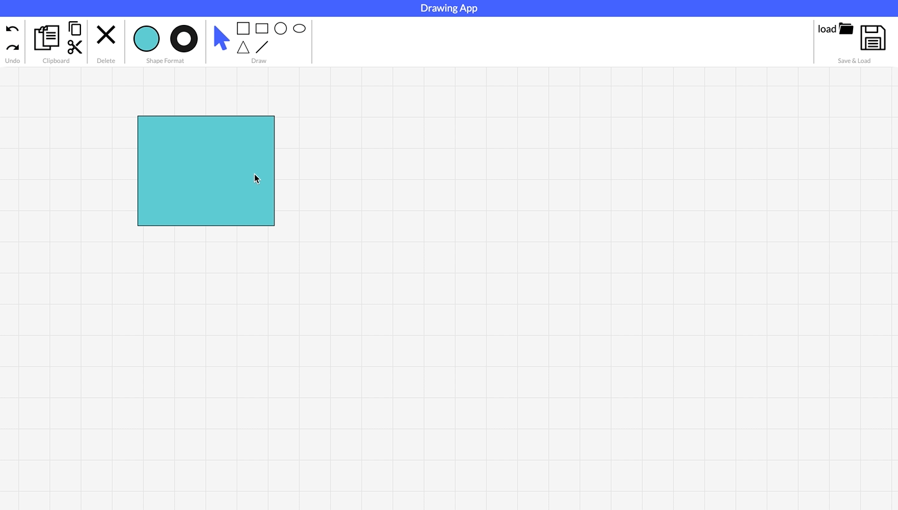
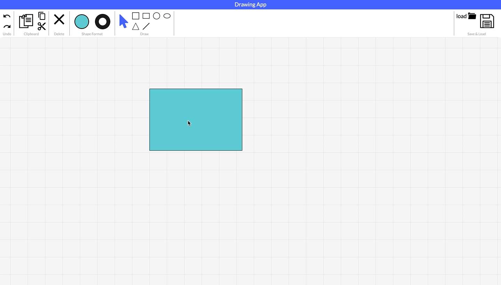

# Drawing App

A web app that supports:

- drawing lines and geometrical shapes ( Square - Rectangle -Circle - Oval - Triangle)
- Editing the shape parameters:
  - Width and height
  - Fill color
  - Fill color opacity
  - Border color
  - Border thickness
- Copy / Paste / Cut / Delete
- Undo / Redo
- Save the canvas in XML or JSON format
- Load back the canvas and continue editing

## Demo

#### **Drawing shapes**

#### **Edit a shape**

#### **Copy / Paste**

#### **Undo / Redo**

## Co-developed with 🤝

- Muhannad Nasr
- Shehab Mohamed
- Muhannad Soliman
